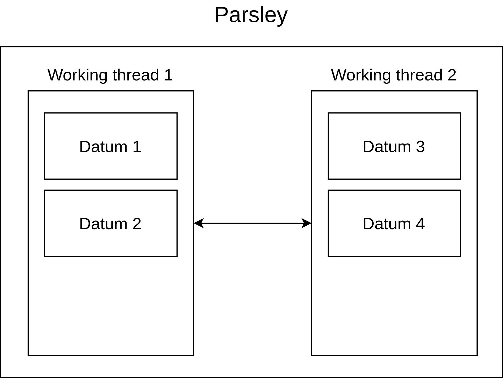
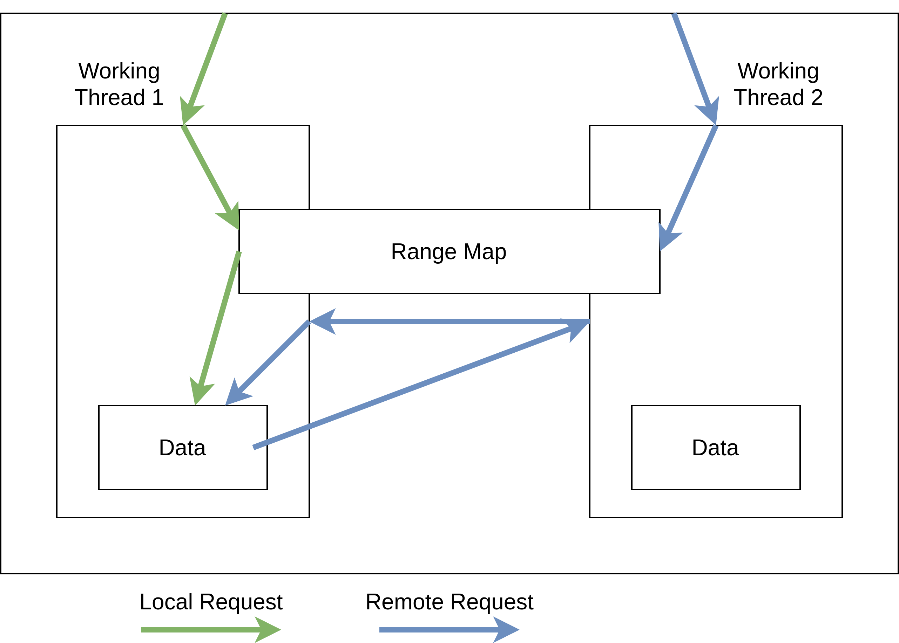
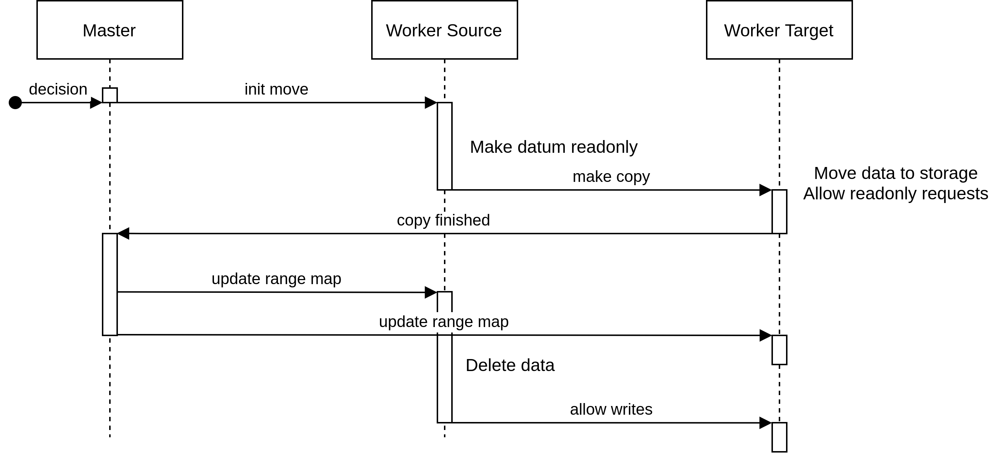

# Sharding

Sharding in parsley is implemented using thread-per-core architecture building blocks. There is a shard running on each thread specified in configuration. Each shard owns a set of data parts called datums. Each datum is linked to a particular storage implementation. If a shard receives request that relates to data which is owned by different shard, such request is forwarded and resolved when response arrives. Currently there is a limitation. When request is forwarded, corresponding data is copied. So, for example, when one queries shard A get(KEY) and the key is on the shard B KEY will be copied to send to B and returned VALUE will also be copied. This can be avoided by using custom smart pointer and MVCC for good performance, e.g. for excluding readers blocking writers and vice versa. Also when server will be implemented connection can be sent to other shard to directly write response to.

To identify a shard containing needed data special structure is used - RangeMap. Each datum is associated with a range. So range is represented using two keys - low and high - and datum contains values for keys between these range keys. Traditional choice for such systems is to use consistent hashing, e.g. shard is determined by key modulo number of shards. For parsley this approach is not suitable because it yields poor performance for scans, and for storage abstraction to be efficient it is better to group similar keys together because it is more likely that access pattern of such keys will match.

Datums are intended to move between working threads during normal operation of the system. Implementation of a datum migration is currently in progress. For management operations like datums movement one of the working threads is assigned a role - master. Master thread is used to coordinate management operations, gather aggregated statistics etc. See proposed algorithm for datum migration in image below. To confirm it is correctly described extensive property-based testing should be performed and it will be good to modelcheck it for correctness.

