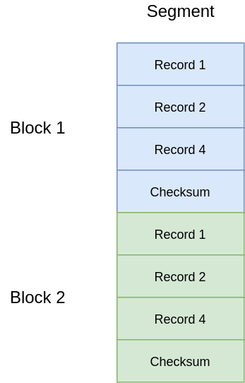

# Write ahead log

Write ahead log is a concept that allows consistent recovery in case of unexpected failure of the system. In parsley it makes sense to create a generic implementation suitable for both, in-memory storage implementations and for keeping internal metadata such as datum assignments. Implementation is in progress.

Implementation consists of a record type which can serialize itself into a buffer, and deserialize from it. Records are grouped into blocks. Block is a minimal set of records that can be restored. Each block is written with checksum which is validated during a restore process. Also block is a unit of group commit, so fdatasync syscall is issued per block and all tasks that write to a block are suspended until a block completion. Blocks are grouped into segments. Segment is a file. 

Depending on a config value, if WAL is used as a part of a block device storage implementation performed a truncation of a log part before device checkpoint. If log is used as an in-memory implementation persistence layer log manager performs a compaction in the background to merge operations related to same keys.

